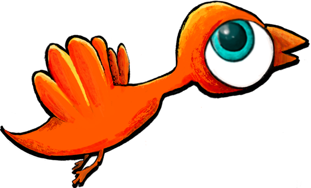

# Derb-the-bird

## [Play the Game!](//insert link here//)

# Description

    Derb is a bird, that knows flying over the city skies is not easy. To survive when flying, he has to dodge all sort of objects that are thrown no him. The objective is to help him get to the finish line (maximum score points). You lose when Derb hits the obstacles 3 times (three lives).

    This game was built for the Project 1 - Ironhack Web Development Course, by Patricia Moutinho (Programming and Design Main Character) and Viviane Ferreira (Programming).

# Main Functionalities

    - Single player game where the player has 3 lives.
    - Player moves to left, right, up and down (using keybord arrows).
    - Avoid obstacles to stay alive.
    - Objective is to get to the finish line (maximum amount of time the game lastes)
    - The game ends if Derb hits objects 3 times (lose), or you get to the finish line (win).

# Backlog Functionalities

    - Creating the character Derb.
    - Improving UI.
    - Making the game.

# Technologies Used

    - HTML
    - CSS
    - JavaScript
    - DOM Manipulation
    - JS Canvas
    - JS Classes
    - JS Functions
    - JS Audio()
    - JS Image()
    - ProCreate
    - Local Storage

# States

    - Start Screen
    - Game Screen
    - Game Over Screen
    - Win Screen

# Project Structure

    Images
    index.html
    styles.css
    README.md

## index.js

    - variables (including images and audio);
    - backgroundLoop();
    - window.onload();
        - functionStartGame();
    - functionUpdateGame();
    - classPlayer();
    - classObstacles();
    - functiongenerateObstacles();
    - functioncollisionDetection();
    - functioncheckGameOver();
    - functionplayerLives();
    - functionscore();
    - functionrestartGame();
    - function resetGame()

# Extra Links

### Trello [Link] (www.trello.com)
### Canva [Link] (www.canva.com)
### Vecteezy [Link] (www.vecteezy.com) - artist: Werayuth Tessrimuang
### EpidemicSound [Link] (www.epidemicsound.com)
### Zoom [Link] (www.zoom.us) XD
### Deploy []
    
# Game Development Credits

    Viviane Ferreira (Programming)
    Patricia Moutinho (Programming and Derb character design)